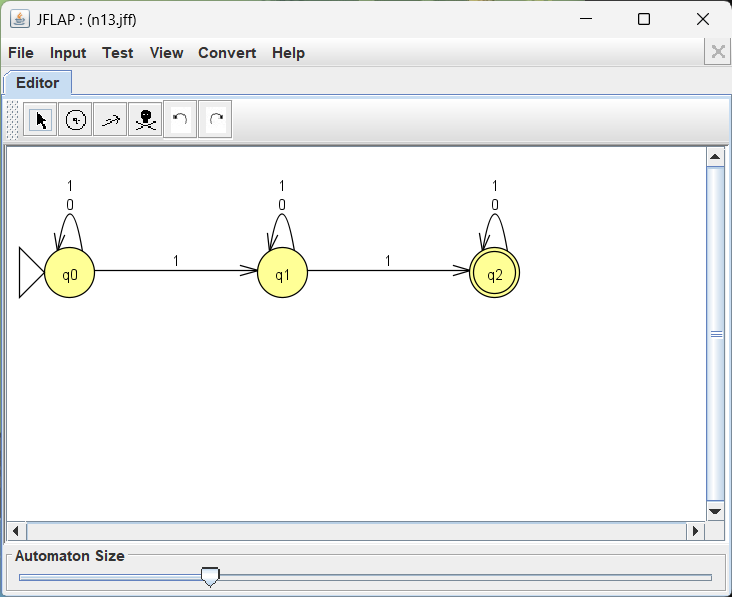
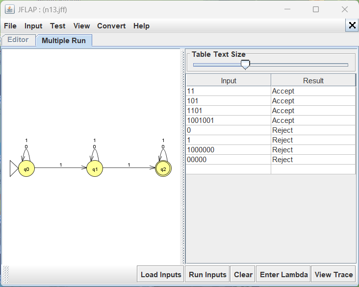

# Problem 13: strings with at least 2 one's

**Language:** { s | s contains at least 2 1's }

## Design notes

This NFA "guesses" which two 1's in the string are the two that satisfy the
condition. From q0, reading a 1 can either stay at q0 (guess: not one of the
chosen two) or move to q1 (guess: this is the first chosen 1). The same
nondeterministic choice happens again from q1 to q2. Once in q2, the
machine has "used up" its two required 1's and just consumes anything else.
This is the classic NFA pattern for "at least k occurrences of a symbol" —
it needs k+1 states and *actual* nondeterminism (two transitions out of the
same state on the same symbol), unlike a DFA which would need to brute-force
track the count directly.

- q0 (start): 0 ones confirmed yet
- q1: 1 one confirmed
- q2 (accept): 2 ones confirmed — absorbing/accepting from here on

## NFA Diagram

<!-- TODO: open n13.jff in JFLAP and take a screenshot of the Editor view, save it as screenshots/n13-nfa.png -->

## Test Strings

See `n13t.txt` for the full list (accepted strings listed before rejected strings).

## Batch Run Results

<!-- TODO: Input -> Multiple Run -> Load Inputs (n13t.txt) -> Run Inputs, then screenshot the results table as screenshots/n13-batchrun.png -->

## Computation Trace (gold-st-ring)

This problem has genuine nondeterminism, so it's a strong candidate for the
computation-tree writeup. Try something like `1101` or `1011` — a string
where there's more than one way to pick "the two chosen ones," so the
tree of computation actually branches into multiple accepting leaves, not
just one.

<!-- TODO if this surprised you:
1. Picture of your hand-drawn computation tree
2. Series of JFLAP screenshots (Input -> Step by State, or Step with Closure)
   showing the transitions after each symbol
-->

## Notes

<!-- Your own observations go here -->
