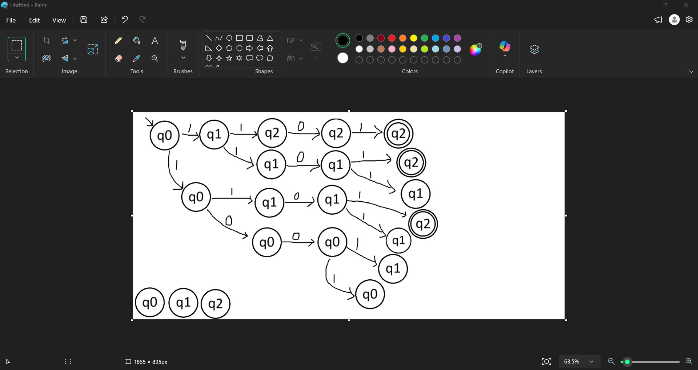
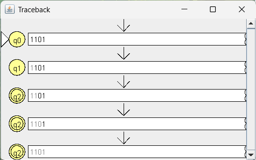

# Problem 13: strings with at least 2 one's

**Language:** { s | s contains at least 2 1's }

## Design notes

This NFA "guesses" which two 1's in the string are the two that satisfy the condition. From q0, reading a 1 can either stay at q0 (guess: not one of the chosen two) or move to q1 (guess: this is the first chosen 1). The same nondeterministic choice happens again from q1 to q2. Once in q2, the
machine has "used up" its two required 1's and just consumes anything else.

* q0 (start): 0 ones confirmed yet
* q1: 1 one confirmed
* q2 (accept): 2 ones confirmed — absorbing/accepting from here on

## NFA Diagram

*NFA for Problem 13*

## Batch Run Results

*Batch run results for Problem 13*

## Computation Trace (gold-st-ring)

I tested `1101` using Input → Step with Closure, since q0 and q1 each have two valid transitions on symbol `1` (self-loop vs. advance), so this NFA explores multiple parallel guesses while reading this string.

### Hand-Drawn Computation Tree

Tree shape: root q0 → splits into {q0, q1} after 1st symbol → each of those
splits again after 2nd symbol → no branching on the 3rd symbol (0) → final
split after 4th symbol, yielding 7 leaves (3 marked accepting).

### Traceback

This path is: q0 →(1)→ q1 →(1)→ q2 →(0)→ q2 →(1)→ q2 — i.e., the simplest
guess, where the NFA counted the 1st and 2nd characters as its two chosen
1's, and then just coasted through the rest of the string from q2.
