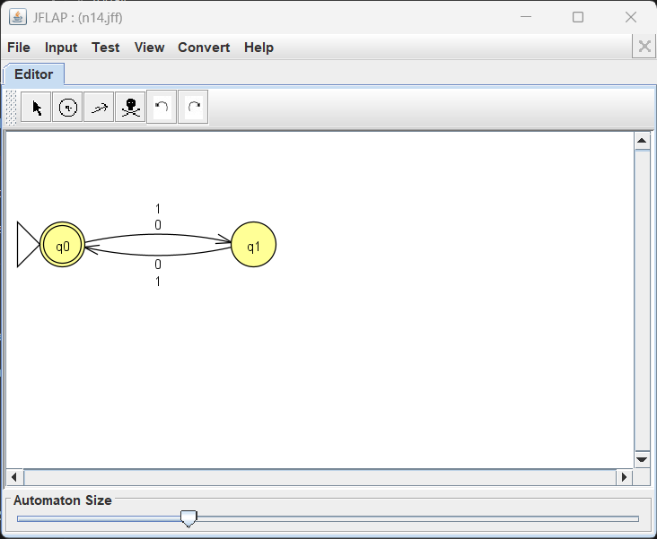
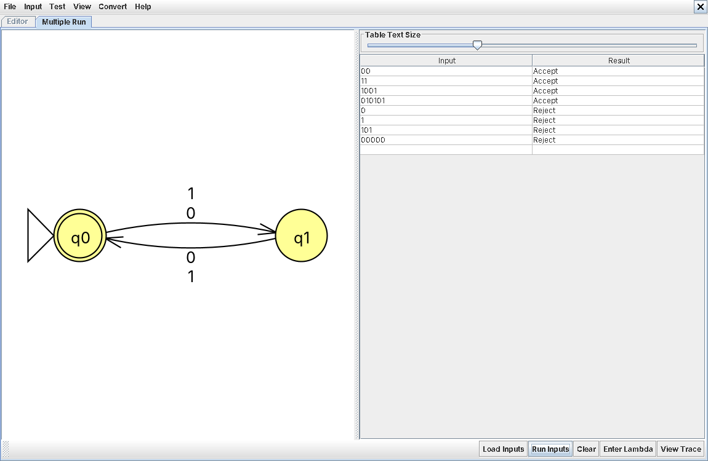

# Problem 14: strings of even length

**Language:** { s | length of s is even }

## Design notes

A simple 2-state alternator: every symbol read (0 or 1) flips between q0 and q1. q0 is both the start state and the only accepting state, so the machine accepts exactly when an even number of symbols have been read — including the empty string.

This NFA has no real nondeterminism in it — every state has exactly one transition per symbol, so it's actually a valid DFA too. Every DFA is a valid NFA, so that's fine.

* q0 (start, accept): even number of symbols read so far
* q1: odd number of symbols read so far

## NFA Diagram

*NFA for Problem 14*

## Batch Run Results

*Batch run results for Problem 14*

## Computation Trace (gold-st-ring)

Since this machine is deterministic, every string has exactly one computation path — no branching to trace, so no hand-drawn tree or traceback needed for this problem.
