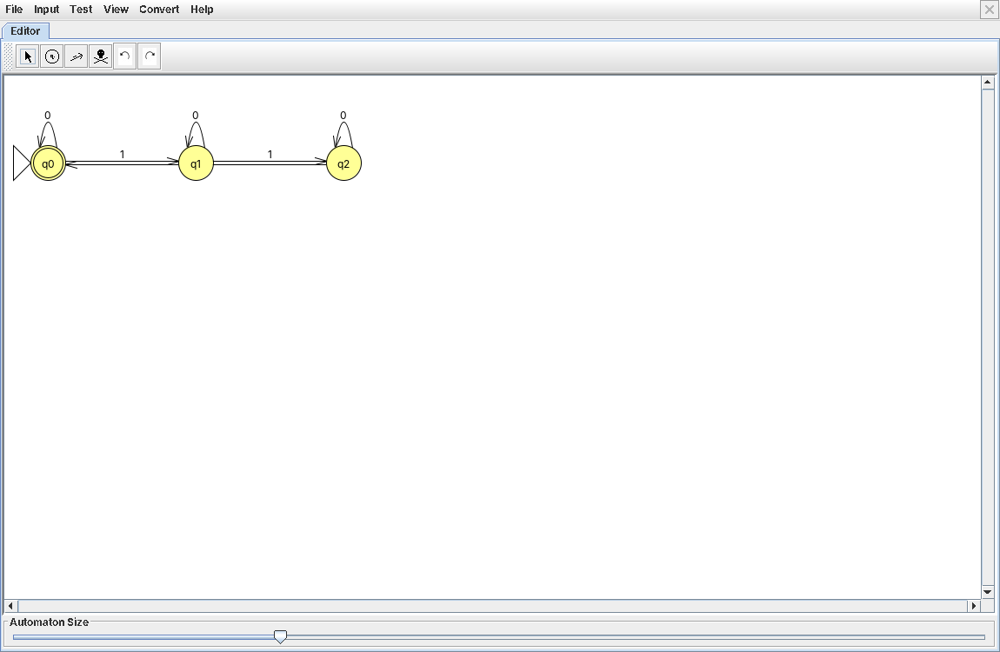
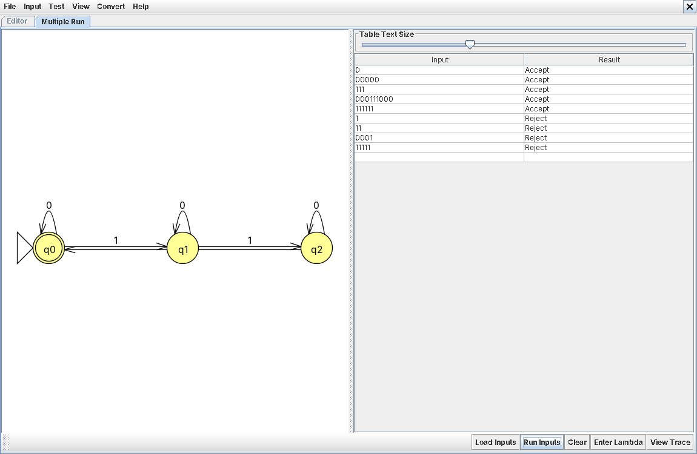

# Problem 17: strings with 3k one's (k ≥ 0)

**Language:** { s | s has 3k 1's, where k ≥ 0 }

## Design notes

A mod-3 counter over the number of 1's. 0's are ignored (self-loop). Each 1 advances the count by one step around a 3-state cycle. The start state q0 is also the accept state, since k=0 (zero 1's) satisfies the language.

Like #14, this is naturally deterministic — exactly one transition per symbol per state, no branching needed, but still a perfectly valid NFA.

* q0 (start, accept): count of 1's ≡ 0 (mod 3)
* q1: count of 1's ≡ 1 (mod 3)
* q2: count of 1's ≡ 2 (mod 3)

## NFA Diagram

*NFA for Problem 17*

## Batch Run Results

*Batch run results for Problem 17*

## Computation Trace (gold-st-ring)

Deterministic machine, so no branching to trace — no hand-drawn tree or traceback needed for this problem.
