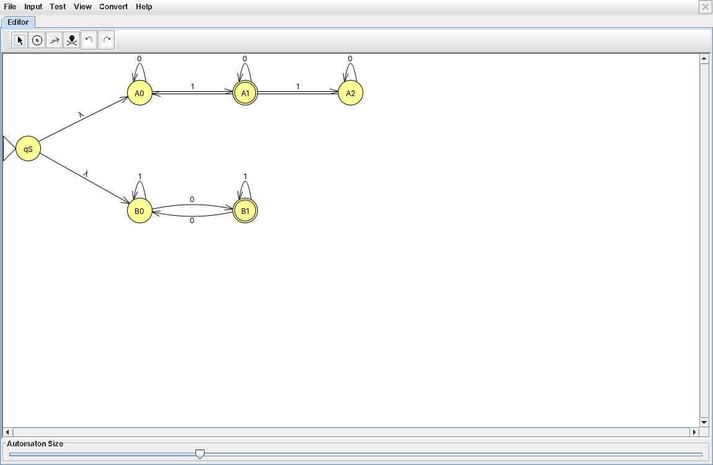
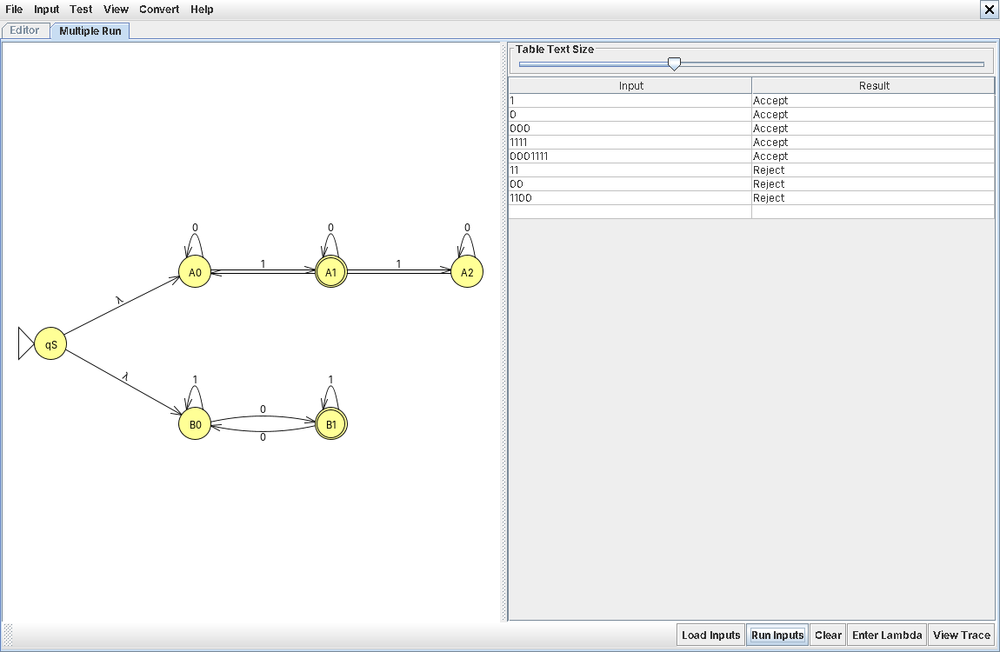
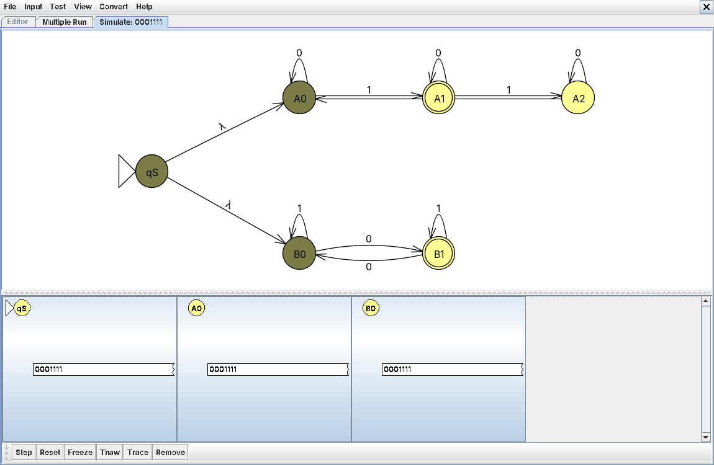
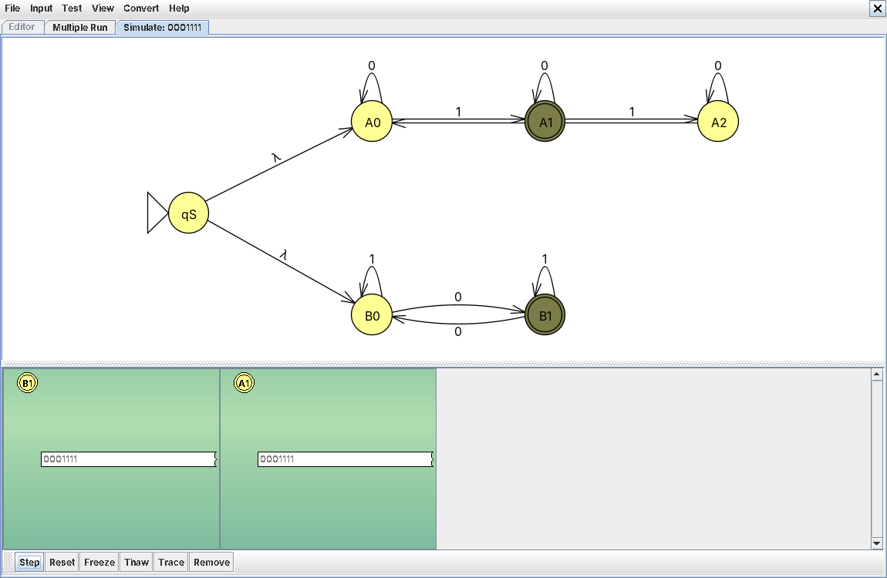
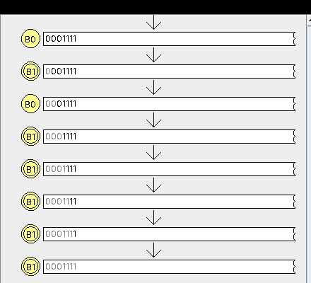

# Problem 20: 3k+1 one's, OR odd number of zero's

**Language:** { s | s has 3k+1 1's (k ≥ 0), OR s has an odd number of 0's }

## Design notes

Built as an NFA union: two independent sub-machines joined by a new start state qS with two λ (epsilon) transitions, one into each sub-machine's start state. The whole thing accepts if either branch reaches its own accept state after all input is consumed.

Branch A — count of 1's ≡ 1 (mod 3): A0 (start) → A1 (accept) → A2 → back to A0.
Branch B — count of 0's is odd: B0 (start, even) ↔ B1 (accept, odd).

* qS (start): splits via λ into both branches at once
* A0, A1 (accept), A2: mod-3 counter of 1's
* B0, B1 (accept): parity counter of 0's

## NFA Diagram

*NFA for Problem 20*

## Batch Run Results

*Batch run results for Problem 20*

## Computation Trace (gold-st-ring)

Tested `0001111` using Input → Step with Closure, since this string satisfies both branch conditions at once (4 ones ≡ 1 mod 3, and 3 zeros is odd).

### Initial Closure

Before a single symbol is consumed, the configuration list already shows **qS, A0, and B0** as three separate active configurations — that's the λ-closure of qS doing its job: both branches are "live" from the very first instant, before any real input symbol is even read.

### Final Configurations

After all 7 symbols are consumed, two configurations survive and both are shaded green (accepting): **A1** (4 ones ≡ 1 mod 3) and **B1** (3 zeros, odd). This string satisfies both branch conditions simultaneously, so both independent guesses succeed.

### Traceback

Isolated the path through branch B: B0 →(0)→ B1 →(0)→ B0 →(0)→ B1 →(1)→ B1 →(1)→ B1 →(1)→ B1 →(1)→ B1 — the parity counter flipping on each of the three 0's and holding steady through the four 1's, landing on B1 (accept).
