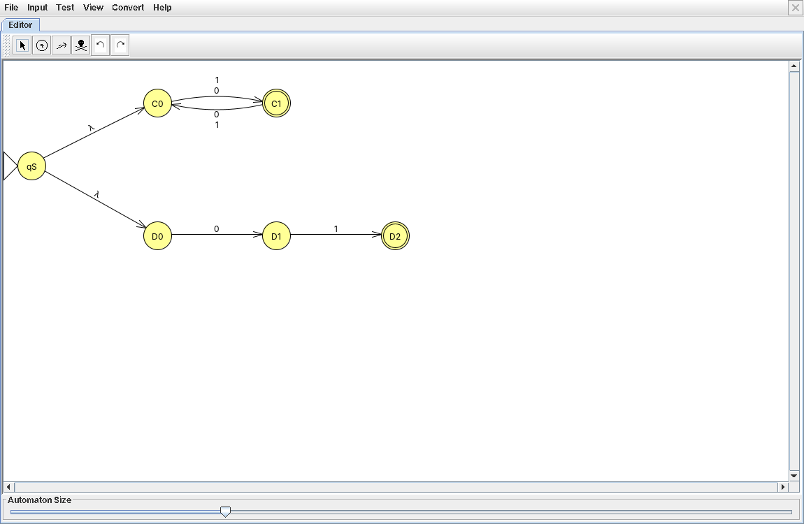
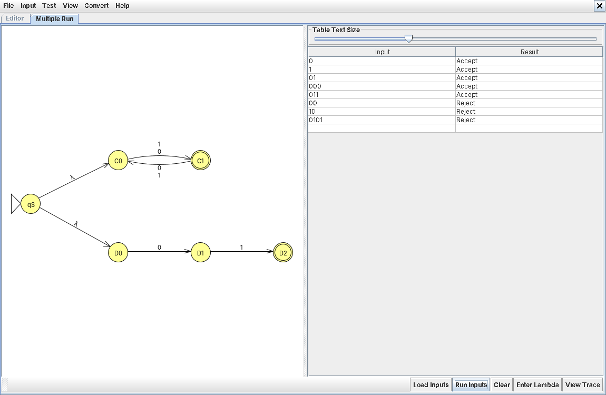
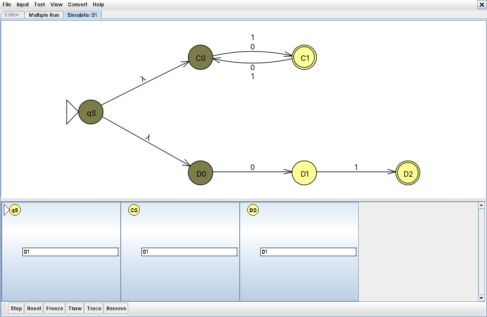
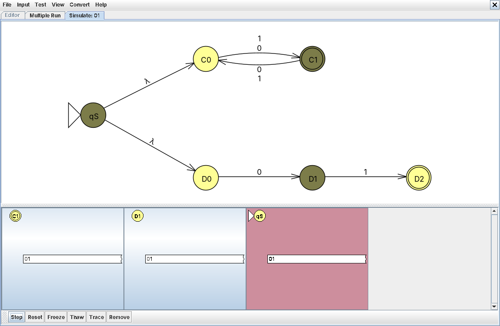
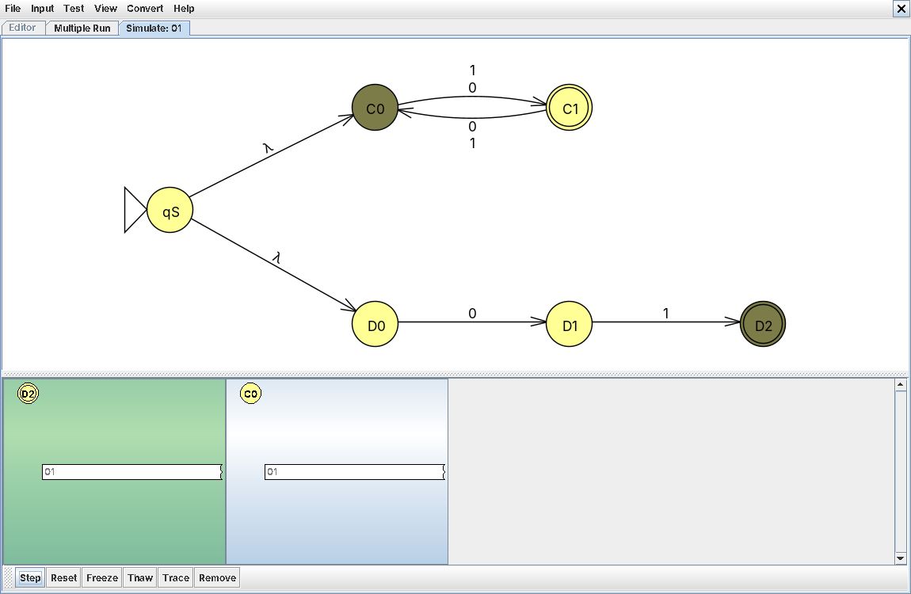
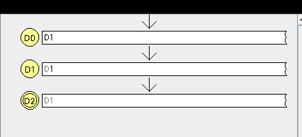

# Problem 23: odd length, OR s = "01"

**Language:** { s | s has odd length, OR s = "01" }

## Design notes

Another NFA union, same pattern as #20: new start state qS with two λ-transitions into two independent sub-machines, accepting if either one finishes in its own accept state.

Branch C — odd length: C0 (start, even) ↔ C1 (accept, odd), alternates on any symbol.
Branch D — exactly the string "01": D0 (start) → D1 (on 0) → D2 (accept, on 1). D1 has no transition for 0, and D2 has no outgoing transitions at all — fine for an NFA, since a missing transition just means that branch dies, not an error.

* qS (start): splits via λ into both branches at once
* C0, C1 (accept): length-parity alternator
* D0, D1, D2 (accept): fixed chain matching exactly "01"

## NFA Diagram

*NFA for Problem 23*

## Batch Run Results

*Batch run results for Problem 23*

## Computation Trace (gold-st-ring)

Tested `01` using Input → Step with Closure.

### Initial Closure

Before any symbol is read, the configuration list already shows **qS, C0, and D0** together — the λ-closure of qS splits into both branches immediately.

### Mid-Trace (after reading `0`)

After the first symbol, three configurations are live: **C1** (branch C, length-parity flipped), **D1** (branch D, matched the required leading `0`), and **qS itself shaded red** — a dead end, since qS only has λ-transitions and no transition defined on `0`, so that particular leftover configuration cannot continue.

### Final Configurations

After the second symbol (`1`): **D2 is shaded green (accepting)** — the exact-match branch succeeded — while **C0 is shaded blue/non-accepting** — branch C's path dies not from a missing transition but simply because C0 isn't an accept state (length 2 is even, so the odd-length branch fails on this string). One branch succeeding while the other fails outright is exactly the nondeterministic union behavior we wanted to see.

### Traceback

Isolated the surviving path through branch D: D0 →(0)→ D1 →(1)→ D2, confirming "01" is accepted via the exact-match branch.
